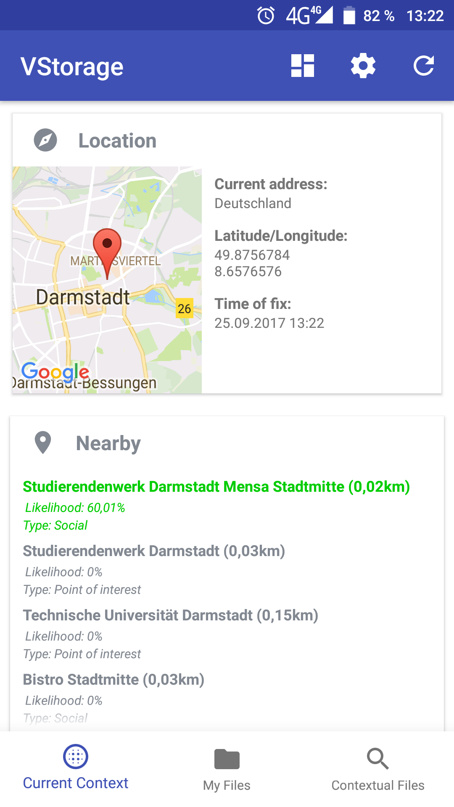
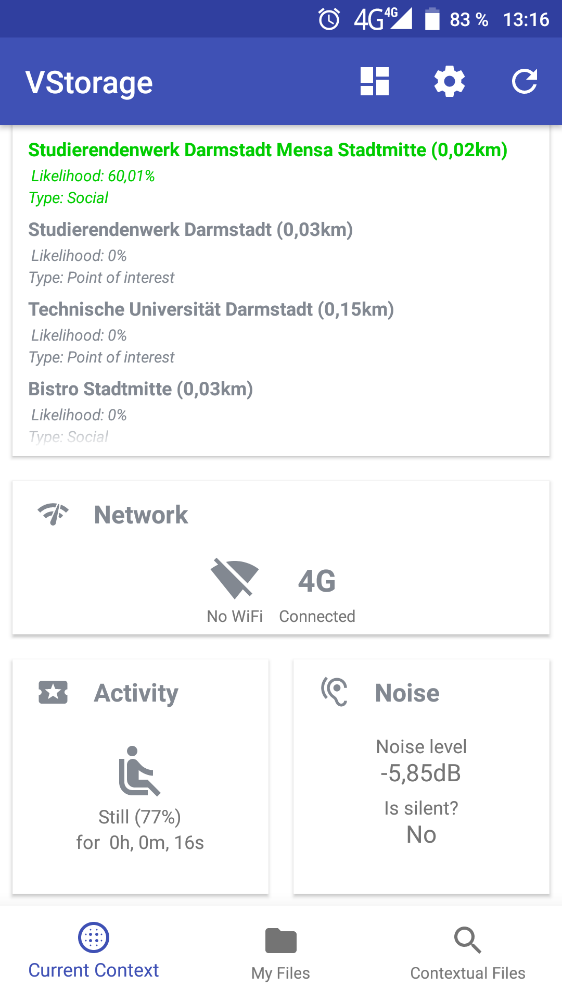
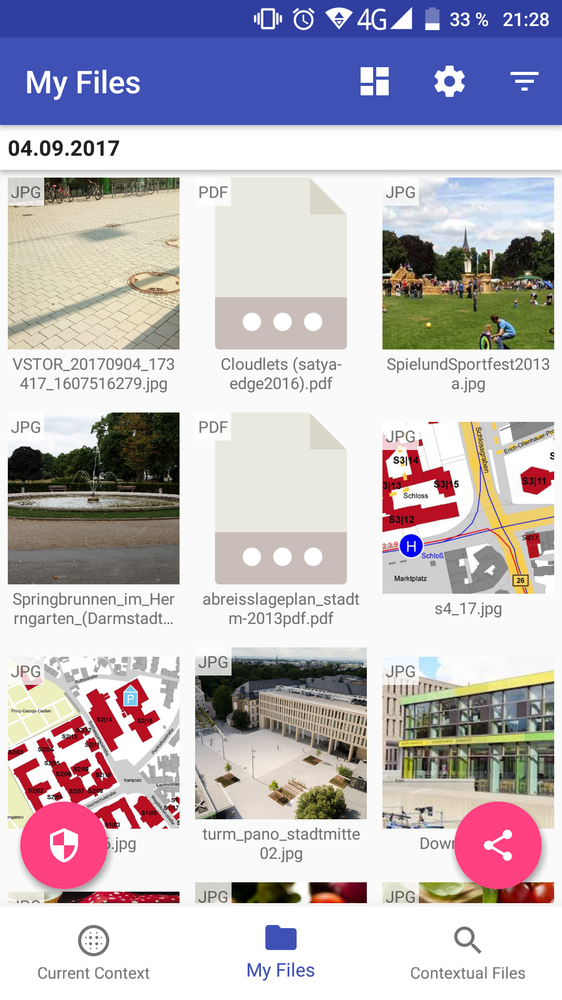
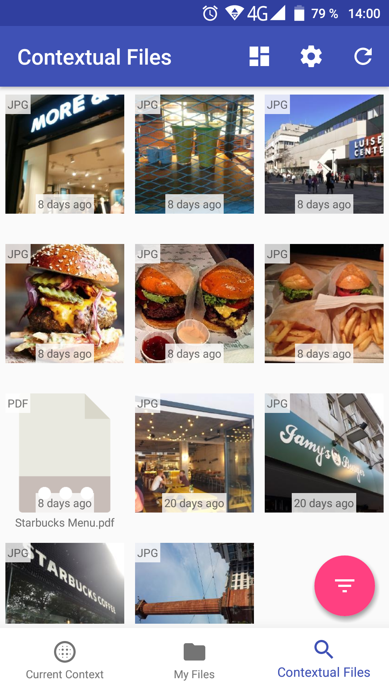
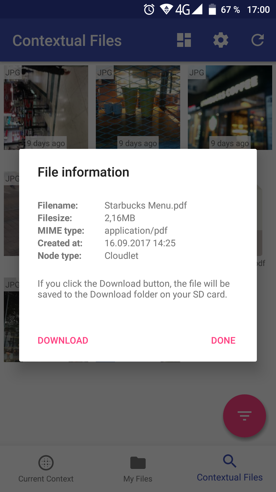
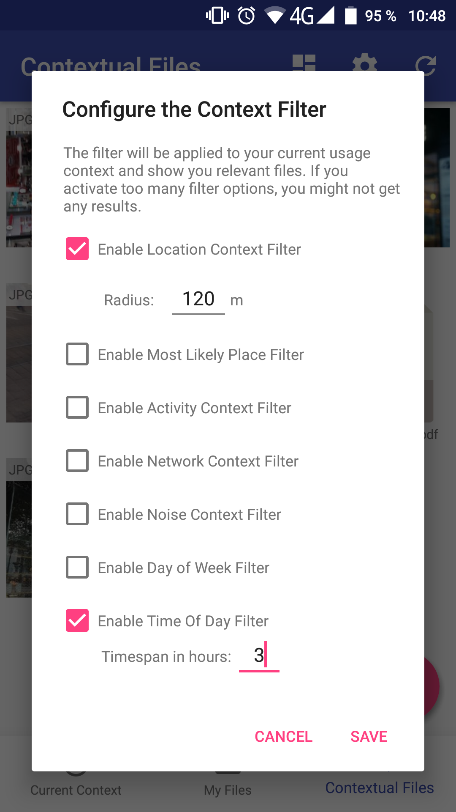

# vstore-android-filebox

A demo application that uses our *vStore* framework to implements a simple file storage manager for Android phones. Please refer to the framework's [main repository](https://github.com/Telecooperation/vstore-framework) and [Wiki](https://github.com/Telecooperation/vstore-framework/wiki) for further documentation. 

__Important:__ Before you can use the application, please change the URL of the vStore master in the [`Application`](https://github.com/Telecooperation/vstore-android-filebox/blob/master/app/src/main/java/vstore/android_filebox/Application.java#L45) class in the package `vstore.android_filebox`.

<table>
  <tr>
    <td></td>
    <td></td>
    <td></td>
  </tr>
  <tr>
    <td></td>
    <td></td>
    <td></td>
  </tr>
</table>
